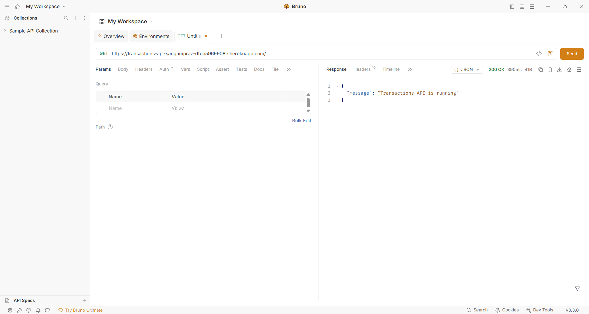
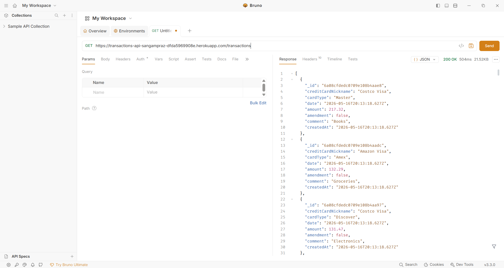
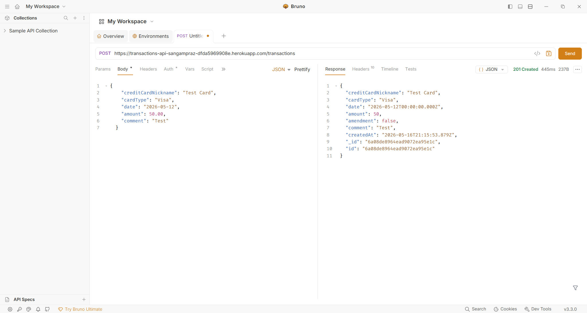
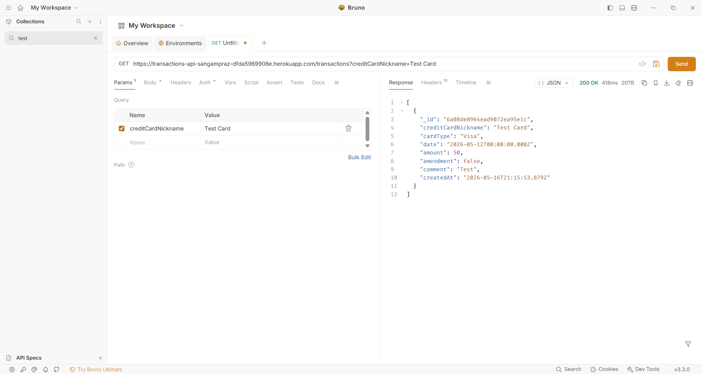

# My First Deployment - transaction-api

1. What were the new things you learned in this activity?

I learned how to build and deploy a full REST API using Node.js, Express, MongoDB, Docker, and Heroku. I learned how to connect a Node.js application to a MongoDB database using MongoDB Atlas and how environment variables are used to securely store configuration values such as database connection string. I also learned how to deploy a web application to Heroku and troubbleshoot deployment issues using Heroku logs. In addition, I gained experience using Docker containers and VS Code Dev Containers to create a consistent development environment. 

2. What is the purpose of the seed.js program?

The prupose of the `seed.js` program is to automatically generate and insert sample transaction data into the MongoDB database. The script creates randomized transactions using predefined card nicknames, card types, comments, amounts, and dates within the last 90 days. This allows the API to have realistic test data for development and testing instead of manually entering transactions one at a time. The program also demonstrates how to connect to MongoDB, insert multiple documents using `insertMany()`, and properly close the database connection after execution. 

3. What was the most dificult thing to do in this activity?

The most difficult part of this activity was deploying the application and connecting all the different technologies together. Troubleshooting MongoDB Atlas connection issues, configuring IP address access, and setting up Heroku environment variables took the most time. Another challenge was ensuring that the deployed Heroku application could successfully communicate with the cloud MongoDB database instead of the local Docker database. Debugging deployment errors and learning how to use Heroku logs to identify problems was also challenging but very helpful. 

4. How would you say you were prudent in this assignment?

I was prudent in this assignment by carefully testing each phase before moving to the next step. I verified API routes locally before attempting deployment and used tools such as Postman, browser testing, and Heroku logs to troubleshoot issues systematically. I also followed secure development practices by using environment variables instead of hardcoding sensitive database information directly into the code. In addition, I ensured that the application validated transaction data before storing it in the database. 

5. How would you say you need to be prudent when developing this kind of web applications?

When developing web applications like this, it is important to be prudent about security, data validation, and deployment configuration. Sensitive information such as database credentials and API keys should always be stored in environment variables and never committed to public repositories. Developers must also carefully validate user input to prevent invalid or malicious data from entering the database. In financial-style applications, prudence is especially important because records should not be improperly modified or deleted, which is why this project used an append-only transaction design. Proper testing, monitoring logs, and securely configuring cloud services are also essential when deploying applications to production environments. 

6. URL of your deployed application as a link.

https://transactions-api-sangampraz-dfda5969908e.herokuapp.com/

7. Screenshots of Postman making requests to your deployed application

